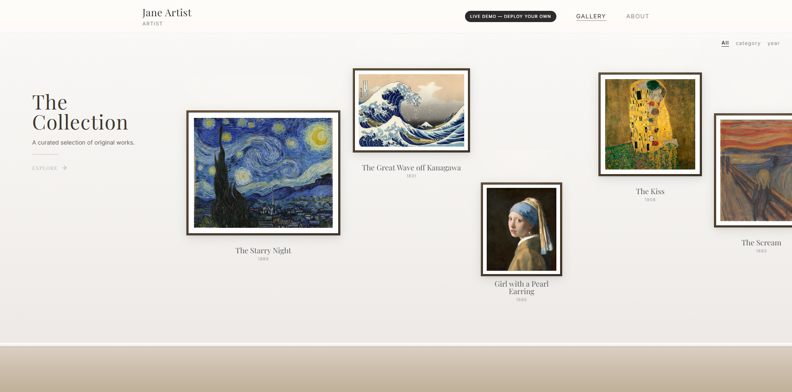

# Art Gallery

A free, self-hosted online gallery for your artwork. Runs entirely on Netlify's
free tier — no server to manage, no database to pay for, no code to write.

**[View the live demo →](https://art-gallery-demo-preview.netlify.app)**
&nbsp;·&nbsp;
**[Deploy your own gallery →](https://app.netlify.com/start/deploy?repository=https://github.com/abe-mart/ArtGallery)**

> The button above uses this repository as a starting template — Netlify
> copies it into your own GitHub account and deploys that copy, not this one
> directly. See
> [Deploying](#deploying) below for the manual steps.

## What you get

- **A gallery wall** your visitors can browse, with a detail view for each piece
- **An admin panel** at `/admin` to add, edit, and remove paintings — including
  built-in tools to straighten, dewarp, white-balance, and even out lighting
  in phone photos of your art, right in the browser
- **A Settings tab** to set your name, site title, hero text, and about page —
  no code editing required
- **An optional PIN** so only people you share it with can see the gallery
- **Basic protection against AI scrapers** — known AI-training bots are
  blocked, and a "no AI training" signal is sent with every image
- **One-click backup** — download everything (paintings, settings, images) as
  a single file, and restore it just as easily
- **$0/month hosting** on Netlify's free tier for a typical portfolio

## Deploying

No coding required. This takes about 10 minutes, start to finish.

### Before you start

You'll need two free accounts: **GitHub** (where the code for your gallery
lives) and **Netlify** (where it actually runs). If you don't have a GitHub
account yet, create one first at [github.com](https://github.com) — it takes
a minute. Once you have it, you can sign in to Netlify using that same
GitHub account, so there's nothing extra to remember.

### Setup Steps

1. Click **[Deploy to Netlify](https://app.netlify.com/start/deploy?repository=https://github.com/abe-mart/ArtGallery)**.
2. Sign in to Netlify — the "Continue with GitHub" option is usually
   easiest, or use Google or email instead.
3. Netlify will ask to connect to GitHub and create a copy of this repo in
   your own account. Approve that.
4. You'll be asked for one setting: **`ADMIN_PASSWORD`**. Choose a password
   you'll use to log into your admin panel — you can change it later.
5. Click **Deploy site**. Netlify will build and publish your gallery —
   this takes a minute or two.
6. Once it says **Published**, open your site. You'll see an empty gallery —
   that's expected, you haven't added any art yet.
7. Go to `yoursite.netlify.app/admin` and log in with the password from
   step 4.
8. Use the **Settings** tab to set your name and site title, then use the
   **Paintings** tab to upload your first piece.
9. Optional: your site starts out at a random address like
   `jolly-pika-123.netlify.app`. To change it, open your site in the
   Netlify dashboard and go to **Site configuration > Domain management**.
   There you can either pick a different `*.netlify.app` name for free, or
   add a domain you already own.

That's it — no database to set up, no server to configure.

## Protecting your art

No online gallery can make images impossible to copy — anything a browser can
display, someone can screenshot. What this app does is raise the bar and make
your position clear:

| Setting | What it does | What it doesn't do |
|---|---|---|
| **PIN gate** (Settings tab) | Requires a PIN before anyone — including bots — can see any painting or image data. This is the strongest option available; turn it on if you're not trying to be found by the public at all, e.g. a private gallery for family, clients, or a specific buyer. | Anyone you give the PIN to can share it further. |
| **Block AI bots** (Settings tab, on by default) | Blocks well-known AI-training crawlers (GPTBot, ClaudeBot, CCBot, and others) from fetching your images or data, sends a `Tdm-Reservation` opt-out header, and publishes a `/robots.txt` disallowing them. | Only stops crawlers that identify themselves honestly — a determined scraper can lie about who it is. |
| **Downscaled uploads** (automatic) | Your art is compressed and capped at 2400px on the long edge before it's stored — the original file on your computer never leaves your browser. | A capped image is still a usable image. |

## Backing up your gallery

In the admin **Settings** tab, click **Export Gallery** to download a single
file with everything in your gallery — paintings, settings, and images.
Keep it somewhere safe. If you ever need to restore it (or move to a new
deployment), use **Import Backup** with that same file — this replaces
everything currently in the gallery, so it's meant for restoring, not merging
in extra paintings.

## FAQ

**Is this really free?**
Yes, for a typical personal portfolio. Netlify's free tier includes 100GB of
bandwidth and generous function usage per month; a personal gallery uses a
small fraction of that. Check [Netlify's current pricing](https://www.netlify.com/pricing/)
if you're unsure your usage will fit.

**I forgot my admin password.**
In the Netlify dashboard for your site, go to **Site configuration > Environment
variables**, edit `ADMIN_PASSWORD` to a new value, and redeploy (or trigger
**Clear cache and deploy site** from the Deploys tab).

**Can I use my own domain?**
Yes — add it under **Domain management** in your Netlify site settings.
Netlify provisions HTTPS for it automatically.

**There's a "Powered by Netlify" badge on my site — can I remove it?**
Yes. Go to **Site configuration > General > Powered by Netlify badge** in
your Netlify dashboard and turn it off. It takes effect immediately, no
redeploy needed.

**How do I get updates to this template?**
If the Deploy button created a real GitHub fork, GitHub's **Sync fork**
button pulls in updates, and Netlify will redeploy automatically. If it
created a plain copy instead, you'll need to merge changes manually — check
this repository's releases for what changed.

**I found a bug / have a feature idea.**
Open an issue on this repository.

## License

The code in this repository is MIT-licensed — see [LICENSE](LICENSE). That
license covers the software only; the copyright to any artwork you upload
remains entirely yours.
